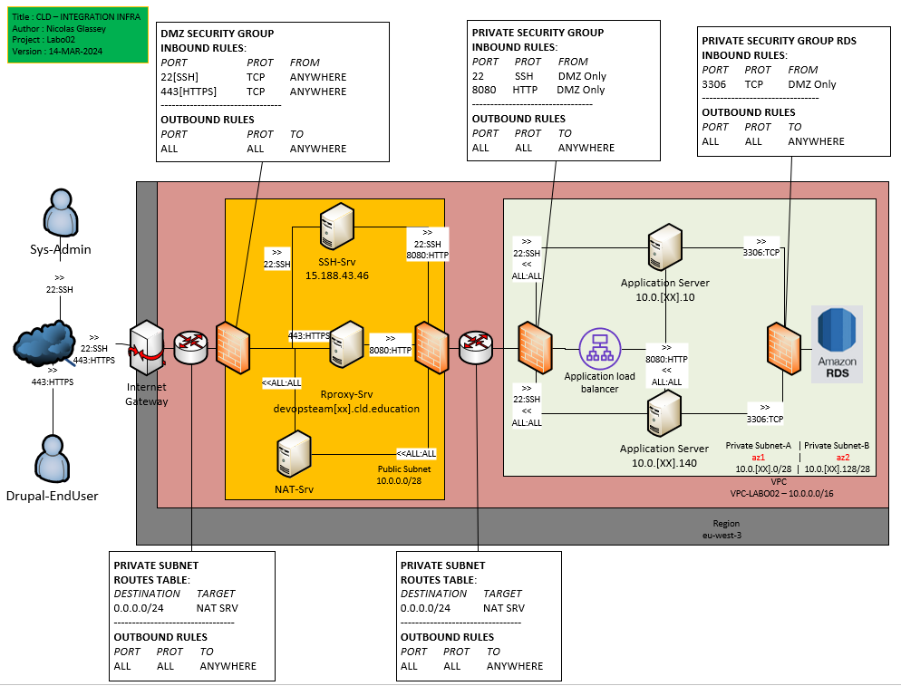

# Create a database using the Relational Database Service (RDS)

In this task you will create a new RDS database that will replace the
MySQL database currently used by Drupal.



Please read the document [What Is Amazon Relational Database Service (Amazon RDS)?](https://docs.aws.amazon.com/AmazonRDS/latest/UserGuide/Welcome.html)
for reference. Once you have read the document, please perform the following steps:

## Task 01 - Prerequisites for RDS Deployment

### [Delete current private subnet](https://awscli.amazonaws.com/v2/documentation/api/latest/reference/ec2/delete-subnet.html)

```bash
[INPUT]
aws ec2 delete-subnet \
--subnet-id subnet-0ad378d360ff015d1
```

```bash
[INPUT]
//describe subnet (to check if always available)
aws ec2 describe-subnets --region eu-west-3

[OUTPUT]
Print a list of all subnets present on the network. In this list we didn't find our so it confirms that it has been deleted. Here is an exemple of the answer : 
"Subnets": [
      {
          "AvailabilityZone": "eu-west-3a",
          "AvailabilityZoneId": "euw3-az1",
          "AvailableIpAddressCount": 11,
          "CidrBlock": "10.0.16.128/28",
          "DefaultForAz": false,
          "MapPublicIpOnLaunch": false,
          "MapCustomerOwnedIpOnLaunch": false,
          "State": "available",
          "SubnetId": "subnet-0971a34e54333b4c9",
          "VpcId": "vpc-03d46c285a2af77ba",
          "OwnerId": "709024702237",
          "AssignIpv6AddressOnCreation": false,
          "Ipv6CidrBlockAssociationSet": [],
          "Tags": [
              {
                  "Key": "Name",
                  "Value": "SUB-PRIVATE-DEVOPSTEAM16b"
              }
          ],
          "SubnetArn": "arn:aws:ec2:eu-west-3:709024702237:subnet/subnet-0971a34e54333b4c9",
          "EnableDns64": false,
          "Ipv6Native": false,
          "PrivateDnsNameOptionsOnLaunch": {
              "HostnameType": "ip-name",
              "EnableResourceNameDnsARecord": false,
              "EnableResourceNameDnsAAAARecord": false
          }
      },
      { ... },
      { ... }
]
```

### [Create your subnets](https://awscli.amazonaws.com/v2/documentation/api/latest/reference/ec2/create-subnet.html)

|Key|Value|
|:--|:--|
|Name|SUB-PRIVATE-DEVOPSTEAM[XX]a/b|
|VPC|Refer to infra schema|
|CIDR-BLOCK|Refer to infra schema|
|Inbound rules|Refer to infra schema|
|Outbound rules|Refer to infra schema|

```bash
[INPUT]
//create subnet A
aws ec2 create-subnet \
--tag-specification "ResourceType=subnet,Tags=[{Key=Name,Value=SUB-PRIVATE-DEVOPSTEAM09a}]" \
--vpc-id vpc-03d46c285a2af77ba \
--cidr-block 10.0.9.0/28

[OUTPUT]
{
    "Subnet": {
        "AvailabilityZone": "eu-west-3a",
        "AvailabilityZoneId": "euw3-az1",
        "AvailableIpAddressCount": 11,
        "CidrBlock": "10.0.9.0/28",
        "DefaultForAz": false,
        "MapPublicIpOnLaunch": false,
        "State": "available",
        "SubnetId": "subnet-0a8b06840338a7299",
        "VpcId": "vpc-03d46c285a2af77ba",
        "OwnerId": "709024702237",
        "AssignIpv6AddressOnCreation": false,
        "Ipv6CidrBlockAssociationSet": [],
        "Tags": [
            {
                "Key": "Name",
                "Value": "SUB-PRIVATE-DEVOPSTEAM09a"
            }
        ],
        "SubnetArn": "arn:aws:ec2:eu-west-3:709024702237:subnet/subnet-0a8b06840338a7299",
        "EnableDns64": false,
        "Ipv6Native": false,
        "PrivateDnsNameOptionsOnLaunch": {
            "HostnameType": "ip-name",
            "EnableResourceNameDnsARecord": false,
            "EnableResourceNameDnsAAAARecord": false
        }
    }
}
```

```bash
[INPUT]
//create subnet B
aws ec2 create-subnet \
--tag-specification "ResourceType=subnet,Tags=[{Key=Name,Value=SUB-PRIVATE-DEVOPSTEAM09b}]" \
--availability-zone eu-west-3b \
--vpc-id vpc-03d46c285a2af77ba \
--cidr-block 10.0.9.128/28

[OUTPUT]
{
    "Subnet": {
        "AvailabilityZone": "eu-west-3b",
        "AvailabilityZoneId": "euw3-az2",
        "AvailableIpAddressCount": 11,
        "CidrBlock": "10.0.9.128/28",
        "DefaultForAz": false,
        "MapPublicIpOnLaunch": false,
        "State": "available",
        "SubnetId": "subnet-0f9df600cde330c7d",
        "VpcId": "vpc-03d46c285a2af77ba",
        "OwnerId": "709024702237",
        "AssignIpv6AddressOnCreation": false,
        "Ipv6CidrBlockAssociationSet": [],
        "Tags": [
            {
                "Key": "Name",
                "Value": "SUB-PRIVATE-DEVOPSTEAM09b"
            }
        ],
        "SubnetArn": "arn:aws:ec2:eu-west-3:709024702237:subnet/subnet-0f9df600cde330c7d",
        "EnableDns64": false,
        "Ipv6Native": false,
        "PrivateDnsNameOptionsOnLaunch": {
            "HostnameType": "ip-name",
            "EnableResourceNameDnsARecord": false,
            "EnableResourceNameDnsAAAARecord": false
        }
    }
}
```

### [Create your security groups](https://awscli.amazonaws.com/v2/documentation/api/latest/reference/ec2/create-security-group.html)

|Key|Value|
|:--|:--|
|Name|SG-PRIVATE-DRUPAL-DEVOPSTEAM[XX]-RDS|
|Inbound rules|Refer to infra schema|
|Outbound rules|Refer to infra schema|

```bash
[INPUT]
aws ec2 create-security-group \
--group-name SG-PRIVATE-DRUPAL-DEVOPSTEAM09-RDS \
--description "SG-PRIVATE-DRUPAL-DEVOPSTEAM09-RDS" \
--vpc-id vpc-03d46c285a2af77ba

[OUTPUT]
{
    "GroupId": "sg-0026b943cb231d124"
}
```

### [Deploy your instance based on your own AMI inside the subnet A](https://docs.aws.amazon.com/cli/latest/userguide/cli-services-ec2-instances.html)

|Key|Value|
|:--|:--|
|Name|EC2_PRIVATE_DRUPAL_DEVOPSTEAM[XX]_A|
|AMI|yours|
|Subnet|your private subnet|
|Key|your key|
|Instance type|t3.micro|
|OS Storage|1x10 Go gp3|

```bash
[INPUT]
//launch instance based on your AMI
aws ec2 run-instances \
--tag-specifications "ResourceType=instance,Tags=[{Key=Name,Value=EC2_PRIVATE_DRUPAL_DEVOPSTEAM09_A}]" \
--image-id ami-0cb080a31d62c154d \
--count 1 \
--instance-type t3.micro \
--private-ip-address 10.0.9.10 \
--key-name CLD_KEY_DRUPAL_DEVOPSTEAM09 \
--security-group-ids sg-0442609af9e1beac9 \
--subnet-id subnet-0a8b06840338a7299
```

```bash
[OUTPUT]
{
    "Groups": [],
    "Instances": [
        {
            "AmiLaunchIndex": 0,
            "ImageId": "ami-0cb080a31d62c154d",
            "InstanceId": "i-05f9070d716bcc424",
            "InstanceType": "t3.micro",
            "KeyName": "CLD_KEY_DRUPAL_DEVOPSTEAM09",
            "LaunchTime": "2024-03-14T16:21:41+00:00",
            "Monitoring": {
                "State": "disabled"
            },
            "Placement": {
                "AvailabilityZone": "eu-west-3a",
                "GroupName": "",
                "Tenancy": "default"
            },
            "PrivateDnsName": "ip-10-0-9-10.eu-west-3.compute.internal",
            "PrivateIpAddress": "10.0.9.10",
            "ProductCodes": [],
            "PublicDnsName": "",
            "State": {
                "Code": 0,
                "Name": "pending"
            },
            "StateTransitionReason": "",
            "SubnetId": "subnet-0a8b06840338a7299",
            "VpcId": "vpc-03d46c285a2af77ba",
            "Architecture": "x86_64",
            "BlockDeviceMappings": [],
            "ClientToken": "9f945453-877e-45e1-946b-3dd80c2eaed0",
            "EbsOptimized": false,
            "EnaSupport": true,
            "Hypervisor": "xen",
            "NetworkInterfaces": [
                {
                    "Attachment": {
                        "AttachTime": "2024-03-14T16:21:41+00:00",
                        "AttachmentId": "eni-attach-05884dbb712f574aa",
                        "DeleteOnTermination": true,
                        "DeviceIndex": 0,
                        "Status": "attaching",
                        "NetworkCardIndex": 0
                    },
                    "Description": "",
                    "Groups": [
                        {
                            "GroupName": "SG-PRIVATE-DRUPAL-DEVOPSTEAM09",
                            "GroupId": "sg-0442609af9e1beac9"
                        }
                    ],
                    "Ipv6Addresses": [],
                    "MacAddress": "06:f3:5b:96:92:a5",
                    "NetworkInterfaceId": "eni-00f490915798cebf2",
                    "OwnerId": "709024702237",
                    "PrivateIpAddress": "10.0.9.10",
                    "PrivateIpAddresses": [
Our terminal hasn't been able to print all the output of the command.
```

### [Find you Drupal Database Engine Version](https://docs.bitnami.com/aws/infrastructure/ruby/get-started/understand-default-config-mariadb/)

```bash
[INPUT]
//check db engine version
mysqld --version

[OUTPUT]
mysqld  Ver 11.2.3-MariaDB for Linux on x86_64 (Source distribution)
```

---

## Task 02 - Deploy RDS

### [Create DB subnet group](https://awscli.amazonaws.com/v2/documentation/api/latest/reference/rds/create-db-subnet-group.html)

|Key|Value for GUI Only|
|:--|:--|
|Name|DBSUBGRP-DEVOPSTEAM[XX]|
|Description|DBSUBGRP-DEVOPSTEAM[XX]|
|VPC|VPC-CLD|
|SubnetIds|Both private subnets|

```
[INPUT]
aws rds create-db-subnet-group \
--db-subnet-group-name DBSUBGRP-DEVOPSTEAM09 \
--db-subnet-group-description DBSUBGRP-DEVOPSTEAM09 \ 
--subnet-ids '["subnet-0a8b06840338a7299","subnet-0f9df600cde330c7d"]'

[OUTPUT]
{
    "DBSubnetGroup": {
        "DBSubnetGroupName": "dbsubgrp-devopsteam09",
        "DBSubnetGroupDescription": "DBSUBGRP-DEVOPSTEAM09",
        "VpcId": "vpc-03d46c285a2af77ba",
        "SubnetGroupStatus": "Complete",
        "Subnets": [
            {
                "SubnetIdentifier": "subnet-0f9df600cde330c7d",
                "SubnetAvailabilityZone": {
                    "Name": "eu-west-3b"
                },
                "SubnetOutpost": {},
                "SubnetStatus": "Active"
            },
            {
                "SubnetIdentifier": "subnet-0a8b06840338a7299",
                "SubnetAvailabilityZone": {
                    "Name": "eu-west-3a"
                },
                "SubnetOutpost": {},
                "SubnetStatus": "Active"
            }
        ],
        "DBSubnetGroupArn": "arn:aws:rds:eu-west-3:709024702237:subgrp:dbsubgrp-devopsteam09",
        "SupportedNetworkTypes": [
            "IPV4"
        ]
    }
}
```

### [Create RDS](https://awscli.amazonaws.com/v2/documentation/api/latest/reference/rds/index.html)

* [Supported MariaDb Version on RDS](https://docs.aws.amazon.com/AmazonRDS/latest/UserGuide/MariaDB.Concepts.VersionMgmt.html)

|Key|Value for GUI Only|
|:--|:--|
|Data type|Standard create|
|Engine options|Check your Drupal Instance|
|Template|Dev/Test|
|DB Instance Identifier|DBI-DEVOPSTEAM[XX]|
|engine|depending on your Drupal config|
|master user name|admin|
|master user name password|DEVOPSTEAM[XX]!|
|Instance config|Burstable classe - db.t3.micro|
|Storage|gp3/20 Go/Disable autoscalling|
|Availability & Durability| do not create a standby instance|
|VPC|VPC-CLD|
|Db Subnet Group|Your own subnet group|
|Existing VPC Security Group|Your own security group for RDS purpose|
|Availability Zone|eu-west-3a|
|Monitoring|Disable Enhanced Monitoring|
|Backup|Disable Enable Automated Backups|
|Encryption|Disable Encryption|

Created on the RDS interface linked here : [AWS RDS plateform](https://eu-west-3.console.aws.amazon.com/rds/home?region=eu-west-3#databases:)

### Security Check : Estimated Monthly Costs

Do you get the same values ?

|Key|Value for GUI Only|
|:--|:--|
|DB Instance|13.87 USD|
|Storage|2.66 USD|
|Total|16.53 USD|

* Copy the estimated monthly cost for the database and add it to your report.

```
//TODO
```

Note : AWS ask for add-on. Close it.

## Task 03 - Test whether the database can be reached from the Drupal Instance

### Get the RDS Endpoint (you need to wait few minutes after launching)

```bash
[INPUT]
//Try to get the same kind of output
```

```bash
[OUTPUT]
[...]
|||                                          Endpoint                                          |||
||+------------------+-------------------------------------------------------------------------+||
|||  Address         |  dbi-devopsteam[XX].xxxxxxxxxx.eu-west-3.rds.amazonaws.com              |||
|||  HostedZoneId    |  XXXXXXXXXXXXX                                                          |||
|||  Port            |  3306                                                                   |||
[...]
```

### Test the access to RDS from your Drupal Instance

```sql
[INPUT]
//help : mysql -h <rds-endpoint> -u <rds_admin_user> -p

[OUTPUT]
```

---

### Questions:

* Compare the costs of your RDS instance to a continuously running EC2 
  instance of the same size using the [AWS calculator](https://calculator.aws/#/addService). (Don't forget to
  uncheck the **Free Usage Tier** checkbox at the top.)

```
//TODO
```

* In a two-tier architecture the web application and the database are
  kept separate and run on different hosts. Imagine that for the
  second tier instead of using RDS to store the data you would create
  a virtual machine in EC2 and install and run yourself a database on
  it. If you were the Head of IT of a medium-size business, how would
  you argue in favor of using a database as a service instead of
  running your own database on an EC2 instance? How would you argue
  against it?

```
//TODO
```

* Copy the endpoint of your RDS.

```
//TODO
```
