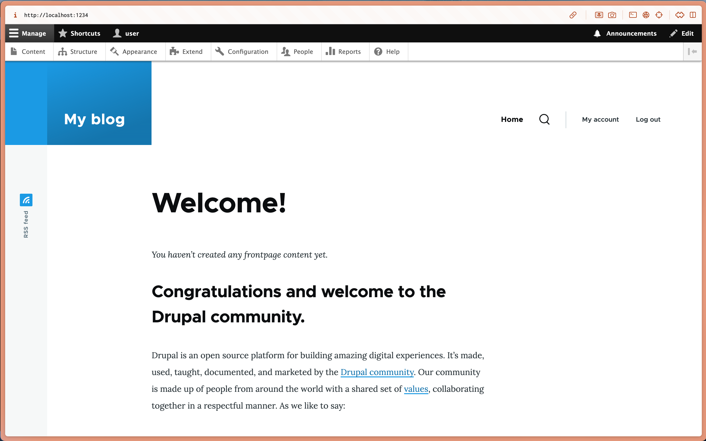

# Task 001 - Configure Auto Scaling


* Follow the instructions in the tutorial [Getting started with Amazon EC2 Auto Scaling](https://docs.aws.amazon.com/autoscaling/ec2/userguide/GettingStartedTutorial.html) to create a launch template.

* [CLI Documentation](https://docs.aws.amazon.com/cli/latest/reference/autoscaling/)

## Pre-requisites

* Networks (RTE-TABLE/SECURITY GROUP) set as at the end of the Labo2.
* 1 AMI of your Drupal instance
* 0 existing ec2 (even is in a stopped state)
* 1 RDS Database instance - started
* 1 Elastic Load Balancer - started

## Create a new launch configuration. 

|Key|Value|
|:--|:--|
|Name|LT-DEVOPSTEAM[XX]|
|Version|v1.0.0|
|Tag|Name->same as template's name|
|AMI|Your Drupal AMI|
|Instance type|t3.micro (as usual)|
|Subnet|Your subnet A|
|Security groups|Your Drupal Security Group|
|IP Address assignation|Do not assign|
|Storage|Only 10 Go Storage (based on your AMI)|
|Advanced Details/EC2 Detailed Cloud Watch|enable|
|Purchase option/Request Spot instance|disable|

```
[INPUT]
aws autoscaling create-launch-configuration \
    --launch-configuration-name LC-DEVOPSTEAM09 \
    --image-id ami-02047ef71d2ce8153 \
    --instance-type t3.micro \
    --security-group-ids sg-0026b943cb231d124 \
    --subnet-id subnet-0a8b06840338a7299 \
    --no-associate-public-ip-address \
    --instance-monitoring Enabled=true \

[OUTPUT]
```

## Create an autoscaling group

* Choose launch template or configuration

|Specifications|Key|Value|
|:--|:--|:--|
|Launch Configuration|Name|ASGRP_DEVOPSTEAM[XX]|
||Launch configuration|Your launch configuration|
|Instance launch option|VPC|Refer to infra schema|
||AZ and subnet|AZs and subnets a + b|
|Advanced options|Attach to an existing LB|Your ELB|
||Target group|Your target group|
|Health check|Load balancing health check|Turn on|
||health check grace period|10 seconds|
|Additional settings|Group metrics collection within Cloud Watch|Enable|
||Health check grace period|10 seconds|
|Group size and scaling option|Desired capacity|1|
||Min desired capacity|1|
||Max desired capacity|4|
||Policies|Target tracking scaling policy|
||Target tracking scaling policy Name|TTP_DEVOPSTEAM[XX]|
||Metric type|Average CPU utilization|
||Target value|50|
||Instance warmup|30 seconds|
||Instance maintenance policy|None|
||Instance scale-in protection|None|
||Notification|None|
|Add tag to instance|Name|AUTO_EC2_PRIVATE_DRUPAL_DEVOPSTEAM[XX]|

```
[INPUT]
aws autoscaling create-auto-scaling-group \
    --auto-scaling-group-name ASGRP_DEVOPSTEAM09 \
    --launch-template LaunchTemplateName=LT-DEVOPSTEAM09 \
    --min-size 1 \
    --max-size 4 \
    --vpc-zone-identifier "subnet-0a8b06840338a7299, subnet-0f9df600cde330c7d" \
    --traffic-sources Identifier=<LB_ARN>
    --target-group-arns <TARGET_GROUP_ARN> \
    --health-check-type ELB \
    --health-check-grace-period 10 \
    --tags "Key=Name,Value=AUTO_EC2_PRIVATE_DRUPAL_DEVOPSTEAM09,PropagateAtLaunch=true"

[OUTPUT]
```

* Result expected

The first instance is launched automatically.

Test ssh and web access.

```
[INPUT]
ssh devopsteam09@15.188.43.46 -i ~/.ssh/CLD_KEY_DMZ_DEVOPSTEAM09.pem -L 1234:internal-ELB-DEVOPSTEAM09-1756587798.eu-west-3.elb.amazonaws.com:8080[OUTPUT]
```

```
//screen shot, web access (login)
```
